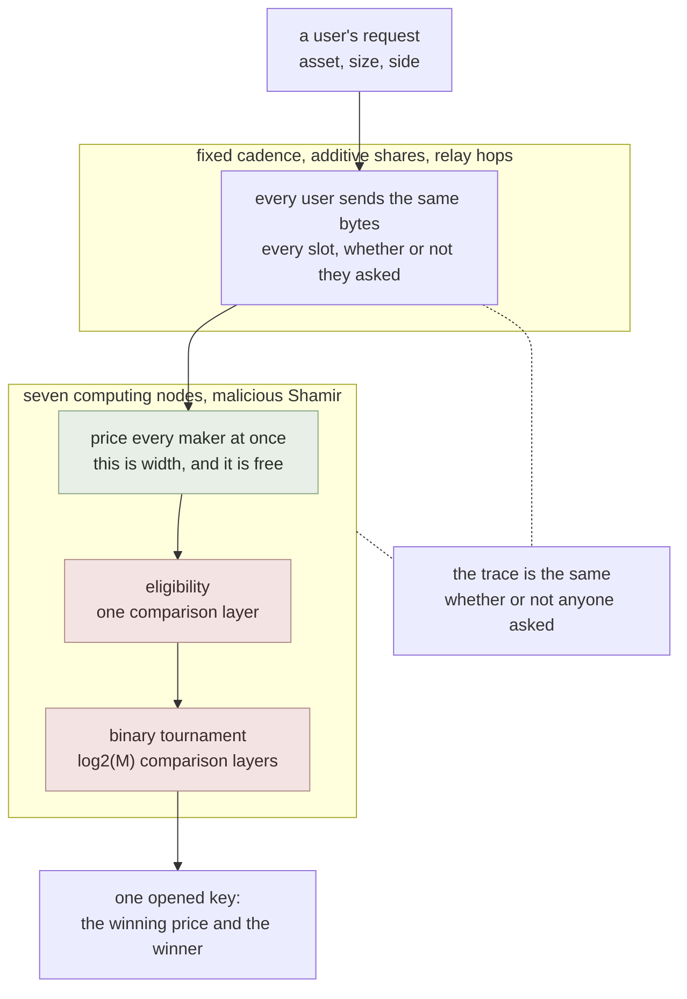
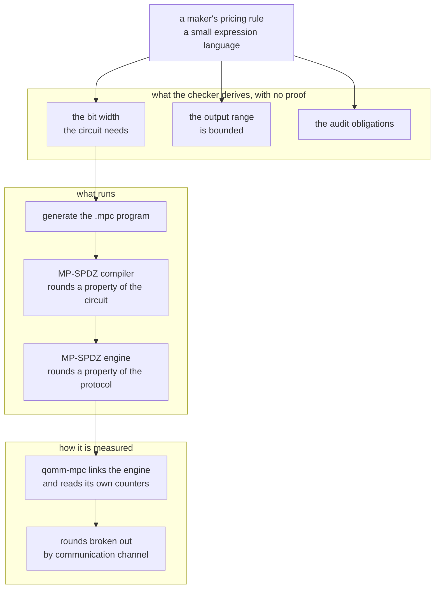

# qomm

**QOMM** is *query-oblivious market making*. It settles through [zkpi](https://github.com/shukob/zkpi) and [defmi](https://github.com/shukob/defmi), a *zero-knowledge payment instruction* and a *decentralized financial market infrastructure*.

Query-oblivious market making: quote without disclosing the request, the pricing rule, or the market.

## What it does



## What it is made of



Exported from a single research tree by `scripts/export_repos.py`, which is why
the layout is regular across the three repositories and why nothing here is
hand-maintained. Corrections are welcome; they belong upstream, and the export
is re-run.

## What is here

Rust:

- `rust/qomm-dsl`
- `rust/qomm-proofs`
- `rust/qomm-sim`
- `rust/qomm-mpc`

Python:

- `qomm_sim/`
- `qomm_dsl/`
- `qomm_audit/`
- `qomm_transport/`
- `mp_spdz/`

`artifacts/` holds the measurements the numbers in the paper are taken from, as
the runners wrote them. Each carries the host it ran on as a label (`host-a`,
`host-b`, `host-c`); `scripts/hosts.py` is the mapping.

## Documents

- [`AUDIT.md`](AUDIT.md) --- what the audit machinery checks, what it catches, and what it costs
- [`DEPLOYMENT.md`](DEPLOYMENT.md) --- what every measurement implies for what to deploy where
- [`BINDING.md`](BINDING.md) --- the one gap between what was computed and what was committed, the two ways to close it, and what each one costs
- [`REGULATION.md`](REGULATION.md) --- which accounts and which statutes a live deployment touches, in Japan and in four other jurisdictions
- [`POSITION.md`](POSITION.md) --- what is new here and what is not, stated line by line against the nearest prior work

## Depends on

- [zkpi](https://github.com/shukob/zkpi)

Cargo picks these up as git dependencies and needs nothing from you. Python does not, so install them first:

```
pip install "zkpi @ git+https://github.com/shukob/zkpi"
```

## Running it

```
cargo test --release          # in rust/
pip install "zkpi @ git+https://github.com/shukob/zkpi"
python3 -m pytest tests/      # from the repository root
```

## Measurements

Every reported number has an artifact and a command that produces it. Where a
measurement needs something not shipped here --- MP-SPDZ, a second host, a market
data feed --- the command says so and fails rather than substituting a default.

## License

MIT. See `LICENSE`.
